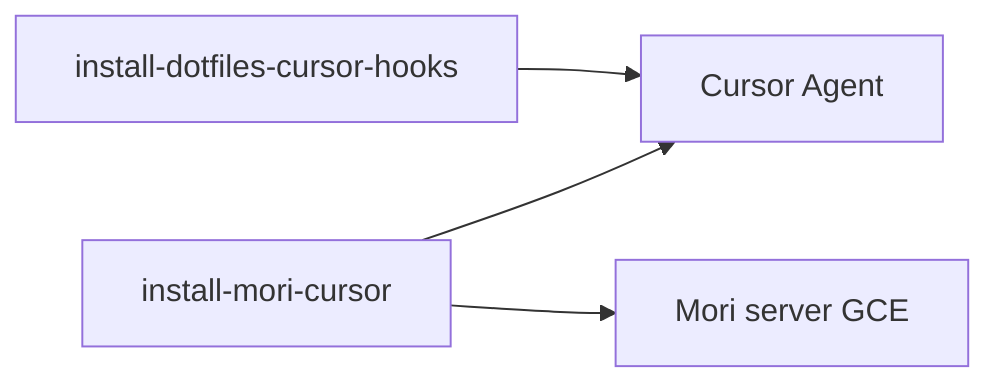

# Getting Started — Mori Cursor Bridge

Connect Cursor 2.4+ to your Mori shared memory server: `/brief`, `/consult`, `/dream`, event capture, and cross-device messaging. Cursor loads the same hooks and skills as Claude Code from `~/.claude/`.

---

## Prerequisites

- **Cursor 2.4+** — loads `~/.claude/settings.json` hooks and `~/.claude/skills/`.
- **Mori server** reachable (homelab, GCE, Tailscale, etc.).
- **Third-party skills enabled:** Settings → Rules, Skills, Subagents → **Enable third-party skills**.
- Optional: API key if the server uses `MORI_ADVISOR_API_KEY`.

---

## Already set up via Claude Code?

If you use Claude Code on this machine, **skills and Mori hooks may already be deployed** under `~/.claude/`. Cursor reuses that path — you often only need MCP in Cursor.

Check what you have:

```bash
ls ~/.claude/skills/
grep -E 'mori-ship-event|mori-post-compact|dotfiles/hooks' ~/.claude/settings.json
```

| You see | Cursor needs |
|---------|----------------|
| `brief`, `wrap`, `msg`, … under `~/.claude/skills/` | Skills OK — run `--upgrade-skills` after a mori repo pull to refresh |
| `mori-ship-event.sh` + GCE URL in `settings.json` hooks | Event capture OK for Cursor too |
| `mori-post-compact-brief.sh` on `PostCompact` | Re-ground after compaction OK |
| `ready` under `~/.claude/skills/` | Personal `/ready` OK (from dotfiles) |
| Nothing under `~/.cursor/mcp.json` | Run Mori installer step 1 (or add MCP manually) |
| No `session-start` / `git-push-guard` in hooks | Run dotfiles hook installer (below) |

**Do not reinstall blindly** — `install-mori-cursor` merges Mori hooks and updates shipper commands; it will not remove your other `settings.json` entries.

---

## Two-layer setup



| Layer | Command | What it enables |
|-------|---------|-----------------|
| **1. Mori bridge** | `install-mori-cursor.sh` / `.ps1` | `~/.cursor/mcp.json`, Mori event hooks, Mori skills from [`mori/skills/`](../skills/), shipper scripts in `~/.claude/` |
| **2. Dotfiles personal** | `~/dotfiles/scripts/install-dotfiles-cursor-hooks.sh` | `/ready`, UK `git push` guard, session-start ops context |

Shared memory lives on the **Mori server** — not on this laptop. Do not use `~/ai-stack/.../memories.db` or a local clone DB.

---

## 1. Mori bridge (installer)

Run from the **mori** repo root.

### Linux / macOS

```bash
./scripts/install-mori-cursor.sh --url "http://<your-server>:8968" \
  --api-key "<key-if-required>" --client "$(hostname)" --force
```

### Windows (PowerShell)

```powershell
powershell -File scripts/install-mori-cursor.ps1 `
  -MoriUrl "http://<your-server>:8968" `
  -ApiKey "<key-if-required>" `
  -ClientName $env:COMPUTERNAME `
  -Force
```

### Doctor and skill refresh

```bash
./scripts/install-mori-cursor.sh --doctor --url "http://<your-server>:8968"
./scripts/install-mori-cursor.sh --upgrade-skills --url "http://<your-server>:8968"
```

```powershell
powershell -File scripts/install-mori-cursor.ps1 -Doctor -MoriUrl "http://<your-server>:8968"
powershell -File scripts/install-mori-cursor.ps1 -UpgradeSkills -MoriUrl "http://<your-server>:8968" -Force
```

Windows installer is pure PowerShell (no Python).

### What the Mori installer writes

| Path | Purpose |
|------|---------|
| `~/.cursor/mcp.json` | HTTP MCP → `http://<server>:8968/mcp` |
| `~/.claude/settings.json` | Mori hooks (`_mori_managed`) + MCP `permissions.allow` |
| `~/.claude/mori-ship-event.*` | Event shipper |
| `~/.claude/mori-post-compact-brief.*` | Post-compaction → `/brief --post-compact` |
| `~/.claude/skills/<name>/` | Copies from `mori/skills/<name>/SKILL.md` |

### Mori hooks (managed by installer)

| Hook | Purpose |
|------|---------|
| `PostToolUse`, `PostToolUseFailure`, `UserPromptSubmit`, `Stop` | Ship events → `/api/events/raw` |
| `PreCompact` | Pre-compaction ship + dream (`--mode precompact`) |
| `PostCompact` | Prompt to run `/brief --post-compact` |

Re-runs upgrade legacy inline `curl` hooks to the shipper and set `_mori_managed: true` without removing other hook entries.

### Mori slash commands (skills)

Deployed as `~/.claude/skills/<name>/SKILL.md`:

| Command | Description |
|---------|-------------|
| `/brief` | Session bootstrap (full or `--post-compact` delta) |
| `/dream` | Distil session events into memories |
| `/consult` | Strategic review |
| `/pensieve` | Search memory store |
| `/ingest` | Ingest local files into remote store |
| `/req` | Requirements tracking |
| `/nats` | Cross-device NATS messages |
| `/msg` | Inter-agent inbox (tasks, questions) |
| `/wrap` | End-of-session publish + dream flush |

See [slash-commands.md](../reference/slash-commands.md) for full options.

---

## 2. Dotfiles personal layer

From your **dotfiles** repo (separate from mori). Wires personal hooks and the `/ready` skill without touching Mori-managed entries.

```bash
chmod +x ~/dotfiles/scripts/install-dotfiles-cursor-hooks.sh
~/dotfiles/scripts/install-dotfiles-cursor-hooks.sh
```

| Hook / skill | Source | Cursor event |
|--------------|--------|--------------|
| `git-push-guard.sh` | `dotfiles/hooks/` | `PreToolUse` — confirm `git push` in UK work hours |
| `session-start.sh` | `dotfiles/hooks/` | `UserPromptSubmit` — ops context (runs **alongside** Mori event shipper) |
| `ready` | `dotfiles/skills/ready/` | Slash command `/ready` (personal bootstrap) |

`PostCompact` is handled by the Mori installer (`mori-post-compact-brief.*` in `~/.claude/`). Keep [`dotfiles/hooks/post-compact-brief.sh`](https://github.com/fjwood69/dotfiles/blob/main/hooks/post-compact-brief.sh) aligned with [`mori/scripts/mori-post-compact-brief.sh`](../../scripts/mori-post-compact-brief.sh) when editing re-ground text.

Example combined `settings.json`: [examples/settings-with-dotfiles.json](../../examples/settings-with-dotfiles.json). Mori-only example: [examples/settings.json](../../examples/settings.json).

---

## Manual MCP config

Copy [.cursor/mcp.json.example](../../.cursor/mcp.json.example) to `~/.cursor/mcp.json` and set your server URL. Add hooks/scripts/skills as in the examples above if not using the installers.

---

## Verify

1. **Reload Cursor window** (Command Palette → *Developer: Reload Window*).
2. **Doctor** (Mori): `./scripts/install-mori-cursor.sh --doctor --url "http://<server>:8968"`
3. **MCP** — Settings → MCP → `mori` connected.
4. **`/brief`** — counts + dream state from server via MCP.
5. **Events** — `curl http://<server>:8968/api/events/health` (count increases as you use Agent).
6. **`/dream --status`** — pipeline state on server.

---

## Troubleshooting

| Symptom | Likely cause | Fix |
|---------|----------------|-----|
| `/brief` works in Claude Code but not Cursor | `~/.cursor/mcp.json` missing | Mori installer or manual MCP; reload window |
| Agent cites local `memories.db` | MCP not connected | Doctor; memory is server-side only |
| Hooks work, MCP tools blocked | Half-install | Re-run Mori installer; check `permissions.allow` |
| Stale slash commands | Old `~/.claude/skills` copy | `install-mori-cursor.sh --upgrade-skills` |
| No re-ground after compaction | Missing `PostCompact` / brief script | Re-run Mori installer |
| No `/ready` | Dotfiles skill not deployed | `install-dotfiles-cursor-hooks.sh` |
| No UK push prompt | Dotfiles hook not merged | Same dotfiles script |
| `jq` error on PostCompact (Linux) | `mori-post-compact-brief.sh` needs `jq` | Install `jq` or use Windows shipper (PowerShell) |

---

## Known limitations

- **PostToolUseFailure** — not verified on Cursor; other hooks are confirmed.
- **PostCompact on Linux/macOS** — requires `jq` for Mori brief hook script.
- **Third-party skills** — Cursor updates can disable this; re-check Settings → Rules, Skills, Subagents.

---

## Notes

- Cursor reads `~/.claude/skills/` directly (also `.cursor/skills/` if you add skills there).
- Claude Code and Cursor share one `settings.json` — install order does not matter; installers merge.
- Optional: [git-hooks.md](../reference/git-hooks.md) for NATS push notifications on `git push`.

---

## Upgrading

- **Mori shipper / MCP / skills:** re-run `install-mori-cursor` (use `--upgrade-skills` to refresh skill files).
- **Dotfiles hooks / ready:** re-run `install-dotfiles-cursor-hooks.sh`.
- Hook failures: `%TEMP%\mori-hook.log` (Windows) or `/tmp/mori-hook.log` (Linux/macOS).
