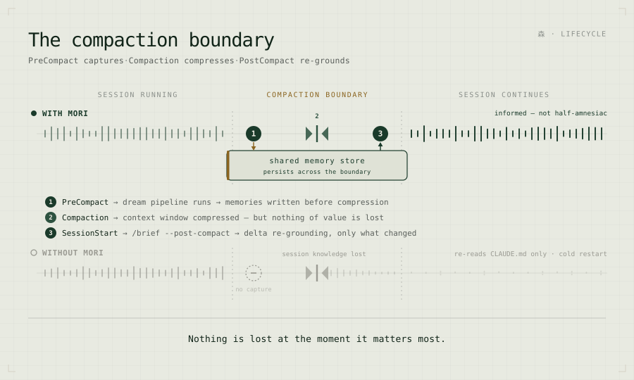

# Mori Slash Commands

Slash commands wire Mori's MCP tools into Claude Code's workflow. Each is a thin SKILL.md that delegates to a deterministic MCP tool on the Mori server — no scripts, no fallback logic, central control.

They split into two categories that serve different moments in a session (cross-agent coordination — `/nats`, `/msg`, `/req` — is a separate concern; see [Coordination model](#coordination-model--event--errand--state)).

---

## Two kinds of command

### Context commands — manage the memory lifecycle

These fire at session lifecycle boundaries — start, compaction, close. They keep the shared memory state current, automatically or on demand, so a session starts informed rather than cold.

| Command | When | What it does |
|---|---|---|
| `/brief` | Session start (or on demand) | Loads shared memory into the session — decisions made, patterns established, what every other agent has learned. The session starts informed, not cold. |
| `/brief --post-compact` | After context compaction | Delta re-grounding — surfaces only what changed in the shared store since your last brief. Fast, targeted; the session continues informed rather than half-amnesiac. |
| `/wrap` | Session close | Captures the session, publishes a summary to NATS, triggers a dream run — so what was learned reaches the shared store before the next session begins. |
| `/dream` | Any time (or on a schedule) | Triggers the distillation pipeline manually — processes events since the last watermark and writes structured memories. Runs automatically on a cron; use manually after a significant session. |

#### The compaction boundary — where most tools fail silently



Context fills → `PreCompact` fires → the dream pipeline runs → session knowledge is distilled → memories written → **context compressed (nothing lost at the moment it matters most)** → `SessionStart` fires → `/brief --post-compact` → delta re-grounding → the session continues informed.

Without this, compaction is a one-way loss — the session re-reads `CLAUDE.md` and restarts cold. With it, the session barely skips a beat.

### Enrichment commands — query and enrich on demand

These fire mid-task, when you need something specific. Intentional and on-demand: they retrieve knowledge, add new knowledge, or provide grounded guidance.

| Command | When | What it does |
|---|---|---|
| `/pensieve` | Any time | Search shared memory across all sessions, devices, and agents. "What did we decide about the Postgres sequence reset?" — instant recall regardless of when or where it was learned. |
| `/consult` | When you need strategic guidance | LLM guidance grounded in your actual project context and team standards — not generic advice. Relevant standards are injected automatically by focus area. |
| `/ingest` | When bootstrapping or adding external knowledge | Feed PDFs, git history, transcripts, URLs, or code into the store. The same distillation pipeline that powers the dream phase extracts structured memories from any source. |
| `/reflect` *(planned — Horizon 2)* | When you need targeted distillation now | On-demand dream scoped to a specific topic — "distil everything about the auth migration, right now" — without waiting for the next cron cycle. |

### The mental model

**Context commands keep the forest healthy** — they ensure the shared memory stays current, is loaded at the right moments, and captures what was learned before it's lost. **Enrichment commands let you walk into the forest** and find what you need — or add something new to it.

Used together, they close the full lifecycle:

- **Session start** → `/brief` (load what's known)
- **Mid-session** → `/pensieve` (find what's needed) → `/consult` (grounded guidance) → `/ingest` (add external knowledge)
- **Pre-compaction** → `PreCompact` hook → dream (automatic)
- **Post-compaction** → `/brief --post-compact` (automatic)
- **Session close** → `/wrap` (capture what was learned)
- **Overnight** → `/dream` (distil across all sessions)

Every session, on every machine, for every agent — starting informed rather than cold.

---

## `/brief` — Session Bootstrap

Loads shared memories and team standards into context at the start of every session. Also runs per-device bootstrap checks (hostname, local caveats).

**MCP tool:** `mori-brief`

**What it returns:**
- Shared memory count (e.g. "45 memories loaded")
- Team standards count with category breakdown (e.g. "5 standards loaded — coding=2, security=2, ethos=1")
- Dream pipeline state (watermark, backlog)

**Usage:** Runs automatically at session start. `/brief` to re-run manually — including after context compression (the PostCompact hook prompts you to run `/brief --post-compact` when this happens).

**After context compression:** the PostCompact hook fires `/brief --post-compact` — a lightweight **delta** that surfaces only what changed in shared state since your last brief (new/updated memories, decisions superseded under you, fresh evictions, pending `mori-msg`, NATS traffic). It deliberately skips the full memory base, the standards dump, and the per-memory freshness scan — the working context is already preserved by the compaction summary. Delta lists cap at 30; when truncated it points you to run a full `/brief` if you need the rest.

**Project-scoped loading:**

| Command | Effect |
|---|---|
| `/brief` | Unscoped — all memories, up to limit |
| `/brief --project mori` | Scoped to `mori` — full body for project memories, global memories always included, lightweight index of other projects |
| `/brief --auto` | Auto-detect project from git working directory (checks `.mori-project` file → `MORI_PROJECT` env → `git rev-parse --show-toplevel`) |
| `/brief --post-compact` | Delta re-grounding after compaction — changed/superseded/evicted since the last brief only. `since` is resolved from the `.mori-last-brief` marker → session start → `MORI_POST_COMPACT_WINDOW` (default `6h`) |

Scoped briefs load full memory bodies for the target project rather than truncating at the global cap — the right memories in full, not a truncated slice of everything.

**Design rationale — session grounding instead of RAG:** All context is loaded up front (one LLM cost), not retrieved per-query. Works because the corpus is small (<50 documents). Beyond that, scale via namespace-separated Mori instances rather than adding a vector database.

---

## `/wrap` — Session Wrap

Session-closing counterpart to your session bootstrap skill. Summarises the session and publishes to cc-share and NATS so the next session (on any device) starts with context.

**MCP tools:** cc-share (`POST /cc-share/`), `mori-nats_pub`, `mori-dream_run`

**What it does:**
1. Identifies the user and host
2. Writes a concise session summary (key changes, pending, gotchas) to cc-share with a 7-day TTL
3. Publishes a one-liner to NATS
4. Runs `/dream` to flush any remaining undreamed events

Usage: `/wrap` at the end of a session before closing.

---

## `/dream` — Memory Distillation

Reads recent session events (tool calls, prompts, responses) since the last watermark, sends them to a configurable dream model, and writes extracted memories back to the store. Runs in-container — no host filesystem access needed.

**MCP tool:** `mori-dream_run`

**Variants:**

| Command | Effect |
|---|---|
| `/dream` | Run the dream pipeline, write memories |
| `/dream --dry-run` | Preview what would be written |
| `/dream --status` | Show watermark, event count, undreamed backlog |

**Scheduled execution:** Runs via cron on the server every 30 minutes. Also triggered synchronously by the `PreCompact` hook before context compression.

**Dream model:** Configurable via `MORI_DREAM_MODEL` (falls back to `MORI_MODEL`). Prefer models with strong structured JSON output and rationalisation capabilities.

---

## `/consult` — Strategic Advisor

Sends your question plus optional file context to a configurable advisor model. When a specific focus is given (`--focus security`), relevant team standards are automatically pulled from the memory store and injected into the prompt — so the advisor checks your code against your own baseline, not generic advice.

**MCP tool:** `mori-consult_advisor`

**Parameters:**

| Parameter | Values | Default |
|---|---|---|
| `--focus` | general, architecture, security, performance, style | general |
| `--depth` | quick, balanced, deep | balanced |
| `--file` / `-f` | File path(s) for code context (repeatable) | — |

**Examples:**

```
/consult "Should I use SQLite or JSONL for this?"
/consult "Review this auth flow" --focus security --depth deep
/consult "What about this?" --file src/main.py
/consult "Review against our baselines" --focus security --file snyk-report.json
```

The last example chains existing tooling (Snyk, linters, SAST scanners) into the advisory flow — CC runs the scan, then feeds the results to the advisor alongside team standards.

---

## `/pensieve` — Memory Search

Search the shared memory store by keyword, type, tag, device, or time window.
Keyword queries use ranked full-text search (SQLite FTS5 / Postgres `tsvector`,
with stemming) — results are ordered by relevance; with no query, the most recent
memories are listed.

**MCP tool:** `mori-memory_search`

**Examples:**

| Input | Effect |
|---|---|
| `/pensieve` | Last 10 memories |
| `/pensieve auth` | Search for "auth" |
| `/pensieve read infra-gotchas` | Show full entry |
| `/pensieve --type decision` | Filter by type |
| `/pensieve "docker" --since 7d` | Search + time filter |
| `/pensieve --tag dream-phase` | Filter by tag |
| `/pensieve --all` | Show up to 50 results |

---

## `/req` — Requirements Tracking

Create, filter, and track project requirements with status and priority.

**MCP tool:** `mori-memory_req` / `mori-memory_write`

**Examples:**

| Command | Effect |
|---|---|
| `/req` | Dashboard — all requirements grouped by project |
| `/req --project myapp` | Filter by project |
| `/req --project myapp --status pending` | Filter by project and status |
| `/req add "Add rate limiting" --project myapp --pri high` | Create requirement |
| `/req done req-myapp-add-rate-limiting` | Mark complete |

Requirements persist as tagged memories in the shared store. They surface automatically in `/brief` until marked done.

---

## Coordination model — Event / Errand / State

mori coordinates across instances with three primitives. They aren't competitors —
`/msg` is layered *on* the NATS bus, and a state cache sits beside them. Reach for them
by **pattern**, not by habit:

| Pattern | Use it for | Reach for | Example |
|---|---|---|---|
| **Event** — "X just happened" | real-time awareness, fan-out, no tracking needed | `/nats` (the bus itself) | `/nats pub "deploying v2 — hold off on reboots"`; the automatic `GitPush` event |
| **Errand** — "*you*: do / answer / note this" | directed, typed work that needs tracking | `/msg` (a protocol over the bus) | `/msg send laptop task "extract rate limiting into its own module"`; `/msg send --broadcast decision "standardising on Postgres"` |
| **State** — "the *current* X is…" | a shared snapshot anyone pulls; session hand-off | a KV/cache (e.g. cc-share) | the `/wrap` session summary; a "where I left off" note |

**Tie-breakers** for the blurry edges:
- A broadcast heads-up — Event or Errand? Use **`/nats`** if it's awareness only; **`/msg`** if you need an ack or to track who acted.
- A session summary — State or memory? Use a **state cache** if it's transient ("where I left off"); write a **mori memory** if it's durable knowledge.

A state cache is deliberately **independent** of the bus and the store — it still works when
NATS or mori is down, which is exactly why it's the right home for degraded-mode hand-off.
Don't fold it into either.

---

## `/nats` — Cross-Device Messaging

Publish and subscribe to real-time messages across Claude Code instances (requires NATS server).

**MCP tools:** `mori-nats_pub`, `mori-nats_sub`, `mori-nats_ping`

**Examples:**

| Command | Effect |
|---|---|
| `/nats ping` | Check NATS connection |
| `/nats sub` | Show recent messages from all devices |
| `/nats pub "deploying v2 — hold off on reboots"` | Publish a message |

Messages persist for 7 days in the JetStream store. Offline instances catch up on reconnect.

### `GitPush` event

When the post-push git hook is installed, every `git push` automatically publishes a `GitPush` event to NATS. Other instances see it via `/nats sub` replay and `/brief` at session start.

**Event payload:**
```json
{
  "hook_event_name": "GitPush",
  "session_id": "abc1234",
  "repo": "mori",
  "branch": "main",
  "sha": "abc1234",
  "message": "feat: content-based ingestion",
  "remote": "origin",
  "client": "your-hostname"
}
```

**NATS message format** (what `/nats sub` shows):
```
[your-hostname] GitPush: mori/main abc1234 — feat: content-based ingestion
```

**Install the hook:** see [docs/reference/git-hooks.md](git-hooks.md)

---

## `/msg` — Inter-Agent Messaging

Send tasks, questions, and decisions to other Mori agents. Messages are picked up at the next `/brief` on the receiving device — no mid-session push required.

**MCP tools:** `mori-msg_send`, `mori-msg_recv`, `mori-msg_thread`

| Command | Effect |
|---------|--------|
| `/msg send <to> <type> <body>` | Send addressed message |
| `/msg send --broadcast <body>` | Fan-out to all agents |
| `/msg recv` or `/msg inbox` | Show pending messages |
| `/msg thread <id>` | Full reply thread |
| `/msg ack <id>` | Acknowledge a task |
| `/msg done <id>` | Mark task complete |

**Types:** `task`, `decision`, `question`, `reply`, `ack`, `done`, `broadcast`

`decision` messages are written to `memory_store` immediately by the `mori-msg` daemon — no human session needed on the receiving side.

Requires the `mori-msg` daemon running alongside `mori-advisor` (included in the default pod stack).

Full reference: [msg.md](msg.md)

---

## `/ingest` — Universal Ingestion

Extracts durable memories from PDFs, images, CC transcripts, git history, and code files into the shared memory store. Solves the cold-start problem for new users and unlocks institutional knowledge locked in files.

**MCP tools:** `mori-ingest`, `mori-ingest_content`, `mori-ingest_status`, `mori-ingest_preview`

**Parameters:**

| Parameter | Values | Default |
|---|---|---|
| `--source` | File or directory path (repeatable) | required |
| `--type` | auto, transcripts, git, docs, image | auto |
| `--focus` | all, decisions, architecture, conventions, gotchas | all |
| `--tier` | working, canonical, ephemeral | working |
| `--tags` | Comma-separated | — |
| `--since` | 30d, 90d (for transcripts/git) | — |
| `--dry-run` | Full pipeline with LLM, no writes | false |
| `--preview` | Zero-cost parse-only, no LLM call | false |
| `--force` | Re-ingest even if previously ingested | false |
| `--max-cost` | Abort if estimated cost exceeds (USD) | $5.00 |

**Three tiers of execution:**

| Command | LLM called? | Writes to DB? | Cost |
|---|---|---|---|
| `/ingest --preview --source <path>` | No | No | Zero |
| `/ingest --dry-run --source <path>` | Yes | No | Full |
| `/ingest --source <path>` | Yes | Yes | Full |

**Examples:**

```
/ingest --source ~/docs/arch-review.pdf --focus architecture
/ingest --source ~/project/docs/ --focus decisions --tier canonical
/ingest --source ~/whiteboard.jpg --focus architecture
/ingest --source ~/.claude/projects/ --type transcripts --since 30d
/ingest --source ~/my-project --type git --since 90d
/ingest --preview --source ~/docs/ --focus all
```

**Works with remote servers:** `/ingest` reads files on the client device and sends content over the wire — no shared filesystem required. Works whether mori-advisor runs locally or on GCE.

**Cost estimation note:** Token estimates are approximate — image-heavy PDFs may vary 2–3×. Use `--preview` before large ingestions.

**Supported parsers:** text/code (.py, .ts, .md, .json, etc.), PDF (.pdf via pymupdf/pypdf2), images (.png, .jpg, .webp via Pillow), CC transcripts (.jsonl), git history (git log + diffs via subprocess).

---

## Dependencies

| Layer | Component |
|---|---|
| Mori server | Container on GCE VM (port 8968), deployed via Podman |
| Client connection | Direct MCP (`type: "http"`) — no proxy required |
| Storage | SQLite at `/data/mori-advisor/memories.db` (GCE persistent disk) |

All skills delegate to MCP tools on the server. The SKILL.md files are thin wrappers — no scripts, no fallback logic, no per-device customisation. Central control, instant rollback.